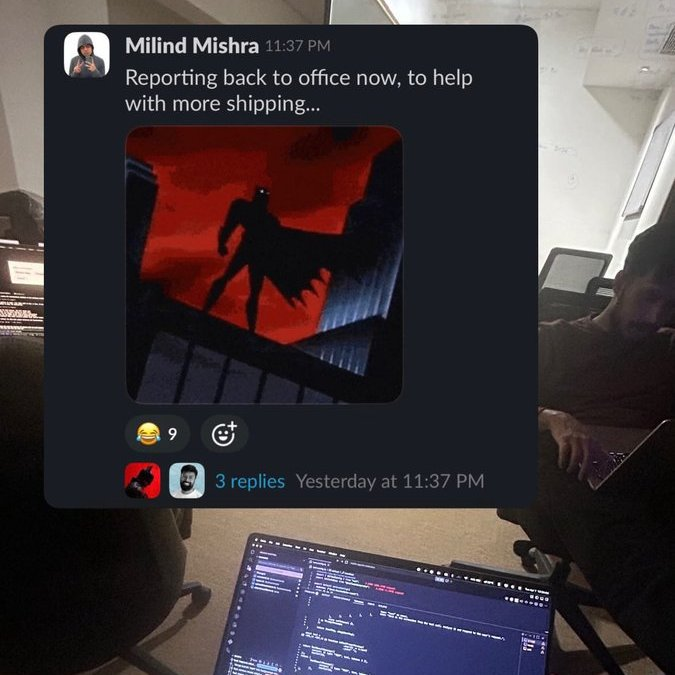
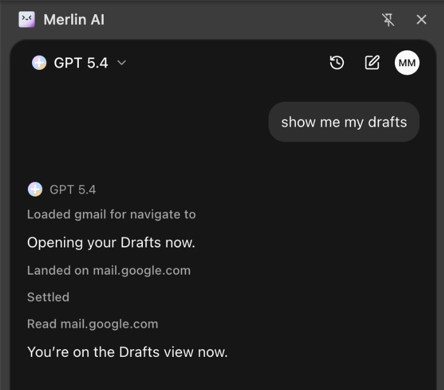
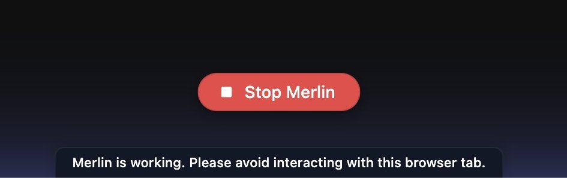
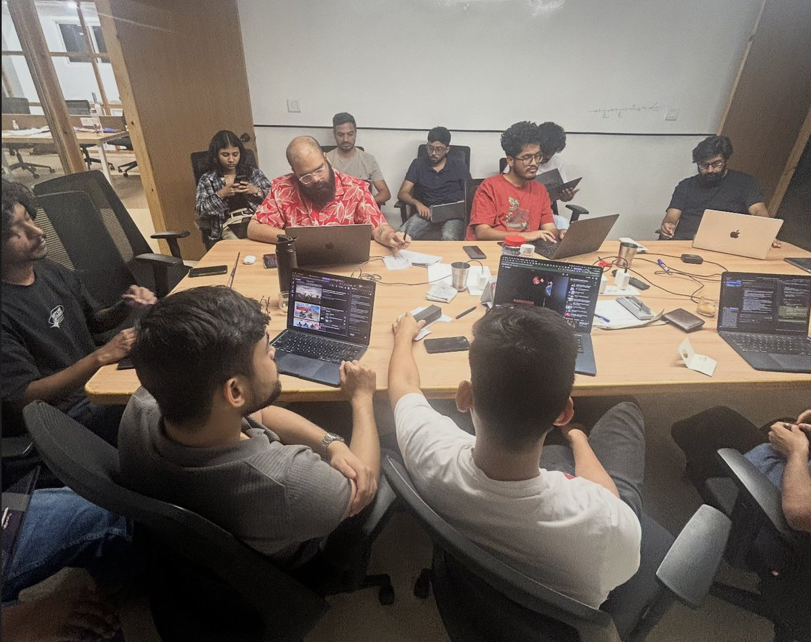
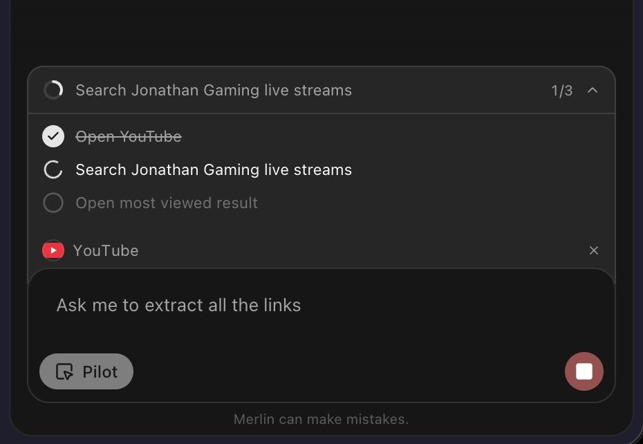
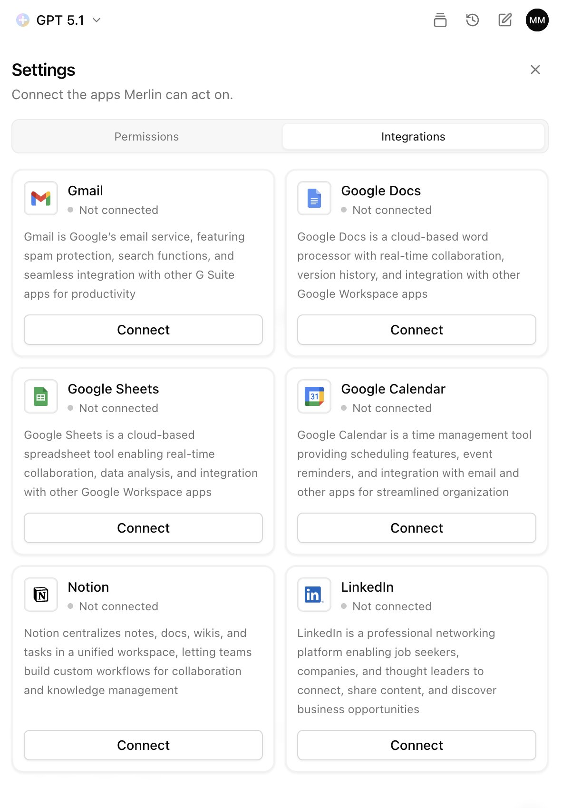

कुछ हफ़्ते पहले, हमारे CEO [Pratyush](https://x.com/pratyush_r8) ने हमसे [Merlin AI](https://x.com/MerlinAIByFoyer) में एक Agentic Chrome एक्सटेंशन बनाने को कहा।

उस वक़्त मैं मार्केटिंग टीम के लिए प्राइसिंग से जुड़े ज़रूरी फ़िक्स में डूबा हुआ था। मुझे अंदाज़ा नहीं था कि आगे क्या होने वाला है।

## टीम

हम तीन लोगों की टीम थे।

https://x.com/milindmishra_/status/2042313218778087907

[Shubhankit](https://x.com/shubhcodes) एजेंट ऑर्केस्ट्रेशन पर काम कर रहा था। [Shahbaz](https://x.com/shahbaz_cse) के पास एक्सटेंशन के पिछले वर्ज़न का कॉन्टेक्स्ट था। मैं [Athul](https://x.com/expectro1897) की मदद से फ़्रंटएंड और पूरा प्रोडक्ट अनुभव संभाल रहा था, और बाद में MCP में गहराई तक उतरा।

छोटी टीम, साफ़ ज़िम्मेदारियाँ।

Shahbaz के पहले के कॉन्टेक्स्ट ने हमें तेज़ी से आगे बढ़ने में मदद की। उसने LinkedIn कंटेंट स्क्रिप्ट्स और डेटा एक्सट्रैक्शन फ़्लो पर ध्यान दिया। चीज़ें आगे बढ़ने के साथ उसने बाद में कुछ MCP टूल्स भी उठा लिए।

मैं तब भी अपना दिया हुआ काम ख़त्म कर रहा था और कूदने का इंतज़ार कर रहा था। जैसे ही समय मिला, हमने पूरी ताक़त झोंक दी।

## बस बनाते रहना

एक छुट्टी और फिर वीकेंड के बाद, हम एक्स्ट्रा घंटे लगा रहे थे और बस शिप कर रहे थे।

कोई ज़रूरत से ज़्यादा प्लानिंग नहीं। बस बनाना, तोड़ना, ठीक करना। इंजीनियरिंग की ख़ालिस ऊर्जा।

मैंने शुरुआत Shubhankit के बनाए प्रोटोटाइप को निखारने से की, कलर टोकन, AI कंटेंट स्ट्रीम हैंडलिंग, और वह सब। एक एक्सटेंशन जो एक बैकएंड रिले से बात करता था, और वही रिले AI कॉल्स संभालता था। बहुत बेसिक। लेकिन काम करता था।

मैंने बुनियादी चीज़ें सही करने पर ध्यान दिया। लेआउट, स्पेसिंग, कंपोनेंट्स, डिज़ाइन टोकन।

https://x.com/milindmishra_/status/2044106263949451631

सिर्फ़ इसे चलाना नहीं, बल्कि इसे सही महसूस कराना।

https://x.com/milindmishra_/status/2043025366458208628

## इंटरैक्शन की बारीकियाँ

फिर आईं इंटरैक्शन की बारीकियाँ।

मैंने छोटे-छोटे संकेत जोड़े, जैसे एजेंट के ऐक्टिव होने पर एक ग्लो। एग्ज़ीक्यूशन रोकने का एक साफ़ तरीक़ा। ऐसे सिग्नल जिनसे यूज़र्स को पता चले कि AI काम कर रहा है।

छोटी चीज़ें, बड़ा फ़र्क़।

## असली वर्कफ़्लो

फिर हमने असली वर्कफ़्लो टेस्ट करने शुरू किए।

- YC ऐप्लिकेशन भरना
- शुरू से आख़िर तक ट्रिप बुक करना
- रिसर्च करना और आउटपुट को व्यवस्थित करना

इसे सच में काम करते देखना अविश्वसनीय लगा।

## टीम डेमो

टीम डेमो एक टर्निंग पॉइंट थे।

पूरी Merlin टीम हमारे Merlin के Agentic एक्सटेंशन की इंटरनल रिलीज़ आज़माते हुए।

हमने एक डायनामिक कन्फ़र्मेशन टूल बनाया जो तरह-तरह की मज़ेदार चीज़ें कर सकता था, तो वह भी था।

https://x.com/milindmishra_/status/2047643032649109640

लेकिन फ़ीडबैक साफ़ था। सिर्फ़ Agentic होना काफ़ी नहीं था। हमें ज़्यादा भरोसेमंद होना था।

## MCP में गहराई तक

तभी मैं MCP में गहराई तक उतरा।

[Composio](https://x.com/composio) के साथ पूरे इकोसिस्टम को खंगाला। Gmail, Calendar, Notion जैसे टूल्स इंटीग्रेट किए। ऑथ और बैकएंड वायरिंग संभाली।

इसने सब कुछ बदल दिया।

बदलाव साफ़ दिख रहा था। AI के सही करने की उम्मीद लगाने से लेकर ऐसे फ़्लो बनाने तक, जिनमें वह सच में काम पूरे करता है। तभी चीज़ें जमने लगीं।

## डेमो

हमने डेमो पर भी बहुत ध्यान दिया। फ़्लो रिकॉर्ड करना। इंटरैक्शन निखारना। यह पक्का करना कि अनुभव असली लगे।

क्योंकि अगर लोग इसे महसूस नहीं करते, तो इसका कोई मतलब नहीं।

## पीछे मुड़कर देखूँ तो

पीछे मुड़कर देखूँ तो यह सिर्फ़ फ़्रंटएंड का काम नहीं था। यह प्रोडक्ट थिंकिंग, डिज़ाइन सिस्टम और AI इंटरैक्शन डिज़ाइन था। शुरू से आख़िर तक की ज़िम्मेदारी।

और सच कहूँ, तो यह मेरे अब तक के सबसे अच्छे कामों में से एक है। दिन-रात छोटी-छोटी डिटेल्स निखारने में लगाए, ताकि यूज़र्स उस परवाह को महसूस कर सकें।

अभी शुरुआत है, अभी सीख रहा हूँ। लेकिन इस प्रोजेक्ट ने AI प्रोडक्ट्स और इंटरफ़ेस बनाने को लेकर मेरी सोच बदल दी।

जल्द ही और।