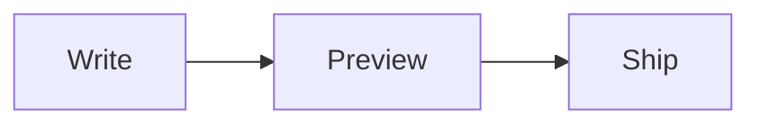

import Embed from "../../../components/Embed.astro";

Markdown विज़ुअलाइज़र वह जगह है जहाँ मैं README और चेंजलॉग लिखता हूँ, उनके कहीं भी पब्लिक होने से पहले। बाईं तरफ़ एडिटर, दाईं तरफ़ प्रीव्यू, और प्रीव्यू हर कीस्ट्रोक के साथ चलता है।

इसकी शुरुआत 4 मार्च 2026 को हुई, उसी दिन जब मैंने [JSON विज़ुअलाइज़र](/hi/project/json-visualiser) को तोड़कर दोबारा बनाया। दूसरा कमिट साफ़-साफ़ कहता है: "init markdown visualizer bearing torch from json vis"। वर्कस्पेस, परसिस्टेंस, और कीबोर्ड की आदतें, सब साथ आ गए। बदला सिर्फ़ फ़ॉर्मैट।

<Embed
  src="https://markdownvisualizer.com/?demo=true"
  title="Markdown विज़ुअलाइज़र"
  caption="लाइव ऐप। एडिटर में टाइप करें और प्रीव्यू साथ-साथ रेंडर होता जाएगा।"
/>

## प्रीव्यू

प्रीव्यू [Streamdown](https://streamdown.ai) से रेंडर होता है, जिसके कोड और Mermaid प्लगइन दूसरे दिन जोड़े गए। फ़ेंस्ड कोड हाइलाइट होता है, और एक `mermaid` ब्लॉक ठीक उसे समझाने वाले टेक्स्ट के बगल में एक असली डायग्राम बन जाता है:

````markdown

````

इसे ऊपर वाले एडिटर में पेस्ट करें और फ़्लोचार्ट अपने आप बन जाएगा।

Streamdown को मैंने यूँ ही नहीं चुना। सितंबर 2025 में, इस ऐप के बनने से महीनों पहले, मैंने इसमें [टेबल कॉपी और CSV डाउनलोड](https://github.com/vercel/streamdown/pull/99) और [कोड ब्लॉक डाउनलोड](https://github.com/vercel/streamdown/pull/102) कॉन्ट्रिब्यूट किए थे। जिस रेंडरर के अंदर मैं पहले काम कर चुका था, उस पर बनाने से प्रीव्यू सबसे आसान हिस्सा बन गया।

## पेन

दस दिन बाद, मैंने लेआउट को दो रीसाइज़ होने वाले पेन में दोबारा बनाया, जिनमें से हर एक पूरी चौड़ाई तक फैल सकता है। उसके एक हफ़्ते बाद शॉर्टकट्स आए, ताकि मुझे बार-बार माउस की तरफ़ हाथ न बढ़ाना पड़े:

| शॉर्टकट | एक्शन |
| --- | --- |
| `Cmd` `E` | एडिटर फैलाएँ, स्प्लिट करने के लिए फिर से दबाएँ |
| `Cmd` `Shift` `P` | प्रीव्यू फैलाएँ, स्प्लिट करने के लिए फिर से दबाएँ |
| `Cmd` `D` | लाइट और डार्क के बीच बदलें |

फिर मैंने हर पेन से हेडर बार हटा दिया। उसके बिना, पेन में बस टेक्स्ट और रेंडर हुआ पेज रह जाता है।

फ़ोन पर स्प्लिट दो टैब्स बन जाता है, Editor और Preview, ताकि कोई भी हिस्सा दबे नहीं।

## ड्राफ़्ट बचे रहते हैं

हर टैब टाइप करते-करते अपना डॉक्यूमेंट IndexedDB में सेव करता है। रीलोड करें, लैपटॉप बंद करें, वापस आएँ, ड्राफ़्ट वहीं मिलेगा। यह एक प्रोग्रेसिव वेब ऐप की तरह इंस्टॉल होता है और ऑफ़लाइन भी चलता रहता है।

न कोई अकाउंट है, और न इसका अपना कोई बैकएंड जो आपका लिखा हुआ स्टोर करे।

[Markdown विज़ुअलाइज़र खोलें](https://markdownvisualizer.com/) और अपना अगला README ड्राफ़्ट करें।
