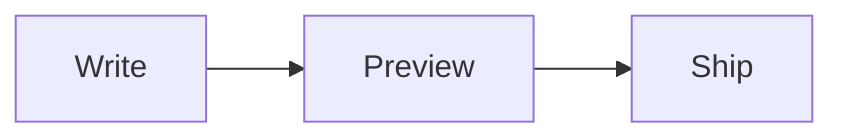

import Embed from "../../components/Embed.astro";

Markdown Visualizer is where I write READMEs and changelogs before they go anywhere public. Editor on the left, preview on the right, and the preview keeps up with every keystroke.

It started on 4 March 2026, the same day I tore down and rebuilt [JSON Visualiser](/project/json-visualiser). The second commit says it plainly: "init markdown visualizer bearing torch from json vis". The workspace, the persistence, and the keyboard habits all came across. Only the format changed.

<Embed
  src="https://markdownvisualizer.com/?demo=true"
  title="Markdown Visualizer"
  caption="The live app. Type in the editor and the preview renders as you go."
/>

## The preview

The preview renders through [Streamdown](https://streamdown.ai), with its code and Mermaid plugins added on day two. Fenced code is highlighted, and a `mermaid` block becomes a real diagram right next to the prose that explains it:

````markdown

````

Paste that into the editor above and the flowchart draws itself.

Streamdown was not a random pick. In September 2025, months before this app existed, I contributed [table copy and CSV download](https://github.com/vercel/streamdown/pull/99) and [code block downloads](https://github.com/vercel/streamdown/pull/102) to it. Building on a renderer I had already worked inside made the preview the easy part.

## Panes

Ten days in, I rebuilt the layout as two resizable panes, each one expandable to full width. A week after that came shortcuts, so I could stop reaching for the mouse:

| Shortcut | Action |
| --- | --- |
| `Cmd` `E` | Expand the editor, press again to split |
| `Cmd` `Shift` `P` | Expand the preview, press again to split |
| `Cmd` `D` | Toggle light and dark |

Then I removed the header bar from each pane. Without it, the panes are just the text and the rendered page.

On a phone the split becomes two tabs, Editor and Preview, so neither side gets squeezed.

## Drafts survive

Each tab saves its document to IndexedDB as you type. Reload, close the laptop, come back, and the draft is still there. It installs as a progressive web app and keeps working offline.

There is no account, and no backend of its own that stores your writing.

[Open Markdown Visualizer](https://markdownvisualizer.com/) and draft your next README.
